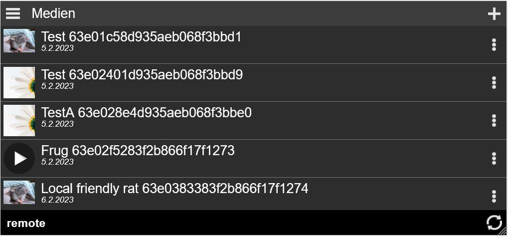
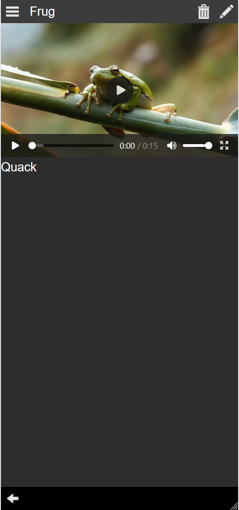
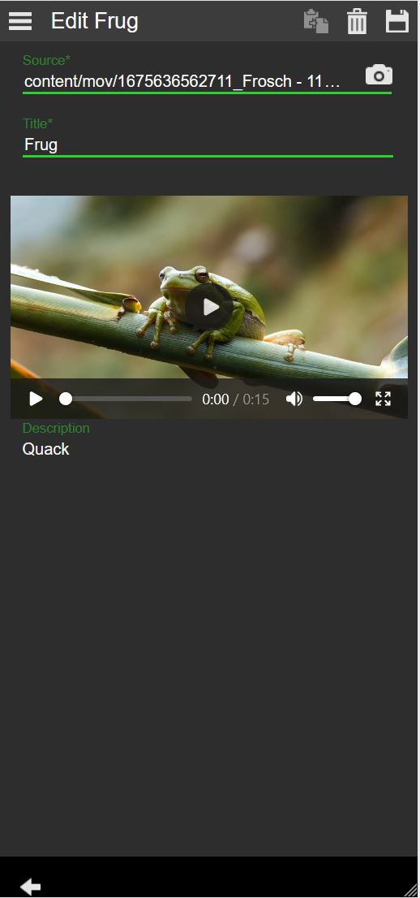

# About The Project

Semester project for my app development university class. The project is UGC to execute CRUD operations on pictures and videos. The app has three views:
- List View with an overview of uploaded content
- Read View for full view of selected content
- Edit View for management of selected content

The app is bootstrapped by custom unviversity framework MWF created by Prof. Dr. Jörn Kreutel of BHT Berlin.
The app is using Node JS for CRUD operations in local MongoDB database and can run in both online and offline mode.

# Built With
- [MWF Framework](https://github.com/dieschnittstelle/org.dieschnittstelle.iam.css_jsl_jsr)
- [Node JS](https://github.com/nodejs)
- [MongoDB](https://github.com/mongodb/mongo)

# Functionality
## List View

## Read View

## Edit View
